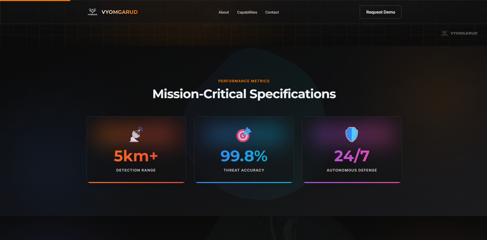
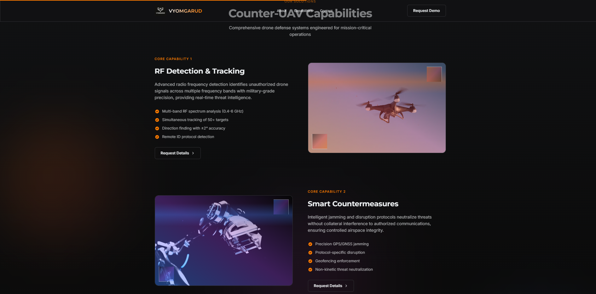
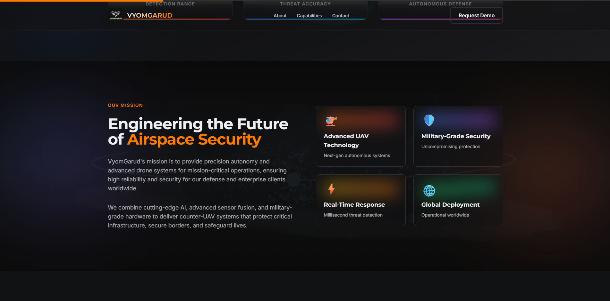
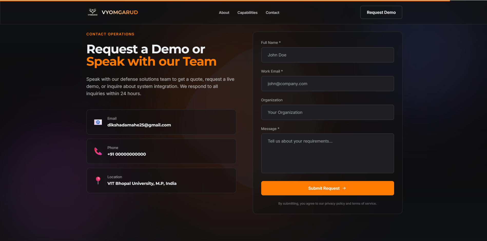
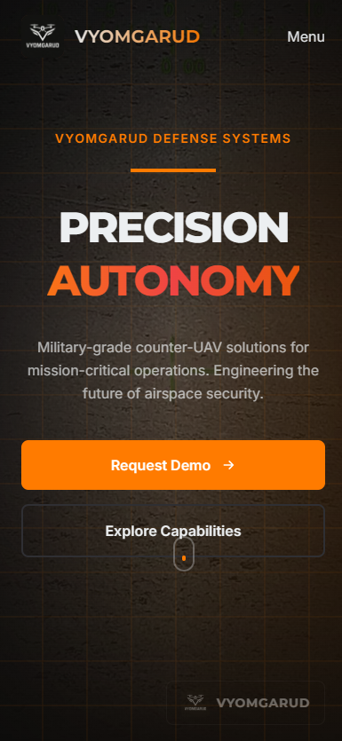
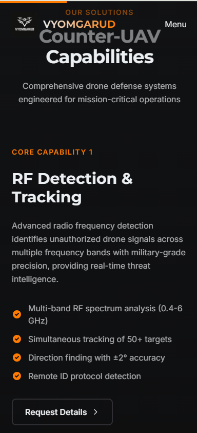

# VyomGarud - Counter-UAV Defense Systems

A modern, responsive landing page for VyomGarud, a military-grade drone defense company. Built as part of the Web Developer Intern Assessment.

## Overview

VyomGarud is a single-page application showcasing advanced counter-UAV defense capabilities through a cinematic, professional interface. The site emphasizes precision engineering, military-grade reliability, and autonomous defense systems.

## Live Demo

- Deployment: https://vyom-garud-seven.vercel.app/

## Tech Stack

- **Framework:** Next.js 15.1.6 (App Router)
- **UI Library:** React 19.0.0
- **Styling:** Tailwind CSS 3.4.0
- **Animations:** Framer Motion 12.23.24
- **Typography:** Montserrat, Inter (Google Fonts)
- **Build Tools:** PostCSS, Autoprefixer

## Screenshots (Placeholders)

Add your screenshots to the `docs/screenshots/` directory using the following filenames. These placeholders are referenced below and will render automatically once you add the images.

- docs/screenshots/01-hero-desktop.png
- docs/screenshots/02-metrics-desktop.png
- docs/screenshots/03-capabilities-desktop.png
- docs/screenshots/04-about-desktop.png
- docs/screenshots/05-contact-desktop.png
- docs/screenshots/06-mobile-hero.png
- docs/screenshots/07-mobile-capabilities.png
- docs/screenshots/08-footer-desktop.png

Preview:

<p>
  
  <br/>
  <em>Cinematic hero with video background, headline, CTAs, and brand watermark.</em>
  <br/><br/>
</p>

<p>
  
  <br/>
  <em>Mission‑critical statistics with animated counters and gradient cards.</em>
  <br/><br/>
</p>

<p>
  
  <br/>
  <em>Zig‑zag capability layout showing visuals and detailed specs.</em>
  <br/><br/>
</p>

<p>
  
  <br/>
  <em>Mission statement with four feature cards: UAV tech, security, response, global.</em>
  <br/><br/>
</p>

<p>
  
  <br/>
  <em>Contact operations with form and styled inputs (validation enabled).</em>
  <br/><br/>
</p>

<p>
  
  <br/>
  <em>Mobile hero view with responsive headline and CTAs; menu button visible.</em>
  <br/><br/>
</p>

<p>
  
  <br/>
  <em>Mobile capability card with stacked layout, visual, and spec list.</em>
  <br/><br/>
</p>

<p>
  
  <br/>
  <em>Footer: brand block, Product/Company/Resources/Legal columns, and the Indian flag.</em>
  <br/><br/>
</p>

## Features

### Design & UI
- Dark, military-aesthetic interface
- Fully responsive (mobile, tablet, desktop)
- Custom color palette (charcoal, steel, brand orange)
- Glass morphism effects and gradient overlays
- Professional typography hierarchy

### Animations
- Scroll-triggered reveals with Framer Motion
- Parallax effects on hero section
- Animated statistics counters
- Smooth section transitions
- Interactive hover states throughout

### Sections
1. **Hero** - Full-screen video background with cinematic presentation
2. **Performance Metrics** - Animated statistics with gradient styling
3. **About** - Mission statement and feature showcase
4. **Capabilities** - Four core defense systems with detailed specifications
5. **Contact** - Functional contact form with validation
6. **Footer** - Multi-column layout with social links

### Technical Highlights
- Optimized video backgrounds
- Next.js Image optimization
- Component-based architecture
- Reusable Tailwind utility classes
- Smooth 60fps animations
- Accessible navigation

## Getting Started

### Prerequisites
- Node.js 18+ 
- npm or yarn

### Installation

1. Clone the repository
```bash
git clone <repository-url>
cd VyomGarud
```

2. Install dependencies
```bash
npm install
```

3. Run the development server
```bash
npm run dev
```

4. Open [http://localhost:3000](http://localhost:3000) in your browser

### Build for Production

```bash
npm run build
npm start
```

## Project Structure

```
VyomGarud/
├── app/
│   ├── globals.css          # Global styles and Tailwind directives
│   ├── layout.jsx           # Root layout with metadata
│   └── page.jsx             # Main landing page
├── src/
│   └── components/
│       ├── NavBar.jsx       # Navigation with scroll effects
│       ├── Hero.jsx         # Full-screen hero with video
│       ├── Highlights.jsx   # Animated metrics section
│       ├── About.jsx        # Mission and features
│       ├── Capabilities.jsx # Product showcase
│       ├── Contact.jsx      # Contact form
│       ├── Footer.jsx       # Site footer
│       ├── MagneticButton.jsx
│       └── ScrollProgress.jsx
├── public/
│   ├── images/              # Static images
│   └── videos/              # Background videos
├── tailwind.config.js       # Tailwind configuration
├── postcss.config.js        # PostCSS configuration
└── package.json
```

## Design System

### Colors
- **Charcoal:** #0B0B0B (primary background)
- **Steel-900:** #111214 (secondary background)
- **Whitesoft:** #ECEFF1 (primary text)
- **Brand Orange:** #FF7B00 (accents)

### Typography
- **Headlines:** Montserrat (Bold/ExtraBold)
- **Body Text:** Inter (Regular/Medium)

### Breakpoints
- Mobile: < 768px
- Tablet: 768px - 1024px
- Desktop: > 1024px

## Key Components

### Hero Section
- Full-viewport video background
- Animated grid overlay
- Magnetic CTA buttons
- Parallax scroll effects
- Company logo watermark

### Capabilities Section
- Four detailed product cards
- Real images and video backgrounds
- Gradient overlays with scan effects
- Alternating zigzag layout
- Detailed specification lists

### Contact Form
- Field validation
- Animated focus states
- Form state management
- Professional styling

## Performance Optimizations

- Video lazy loading
- Next.js automatic code splitting
- Optimized images with Next/Image
- GPU-accelerated animations
- Efficient re-renders with React 19
- Tailwind CSS purging in production

## Browser Support

- Chrome (latest)
- Firefox (latest)
- Safari (latest)
- Edge (latest)

## Development Notes

### Animation Strategy
All animations use Framer Motion with `viewport={{ once: true }}` to prevent unnecessary re-renders. Scroll-triggered animations use `whileInView` with appropriate margins for optimal timing.

### Styling Approach
Custom Tailwind utilities are defined in `globals.css` for consistent spacing, typography, and UI elements. This ensures maintainability and reduces code duplication.

### Component Philosophy
Components are kept small and focused. Shared logic is extracted into custom hooks or utility functions. Each component handles its own animations and state.

## Implementation Notes

### Fully Functional Features
- **Navigation:** All anchor links scroll to corresponding sections
- **Scroll Progress Bar:** Real-time tracking of page scroll position
- **Animations:** All Framer Motion effects working on scroll and hover
- **Responsive Design:** Tested across mobile, tablet, and desktop viewports
- **Videos:** All background videos play with proper aspect ratios
- **Form UI:** Contact form has validation and visual states

### Placeholder Elements
The following elements are implemented for UI/UX demonstration but are not connected to backend services:

- **Contact Form Submission:** Form validates inputs but does not send data (displays alert message only)
- **Social Media Links:** LinkedIn, Twitter, GitHub icons link to "#" (no actual social profiles)
- **Footer Navigation Links:** All footer links (Privacy Policy, Terms, etc.) redirect to homepage
- **"Request Demo" Buttons:** Navigate to contact section (no actual demo system)
- **"Learn More" Buttons:** Link to "#" placeholder

### Future Enhancements
For production deployment, the following would need to be implemented:
- Backend API for contact form submission
- Email notification system
- CMS integration for dynamic content
- Actual social media profile links
- Legal pages (Privacy Policy, Terms of Service)
- Analytics integration
- SEO optimization with meta tags

## Assessment Requirements

This project fulfills all requirements from the Web Developer Intern Assessment:

- Modern, responsive landing page
- React/Next.js framework
- Tailwind CSS styling
- Dark, professional aesthetic
- Required sections (Hero, About, Capabilities, Highlights, Contact, Footer)
- Subtle animations throughout
- Clean, organized code
- Comprehensive documentation

## Development Approach

### Design Philosophy
The site prioritizes visual impact and user experience over backend complexity, as appropriate for a frontend assessment. All interactive elements provide visual feedback, and the navigation creates a smooth single-page application experience.

### Code Organization
Components are modular and reusable. The design system is centralized in `globals.css` with custom Tailwind utilities. This approach demonstrates understanding of component architecture and maintainable CSS practices.

## Credits

- Design inspiration: Anduril, Raphe, Tesla
- Fonts: Google Fonts (Montserrat, Inter)
- Icons: Custom SVG implementation
- Videos and images: Public folder assets

## License

This project was created for educational and assessment purposes.

---

**Built with love and attention to detail By Diksha Damahe❤️.**
